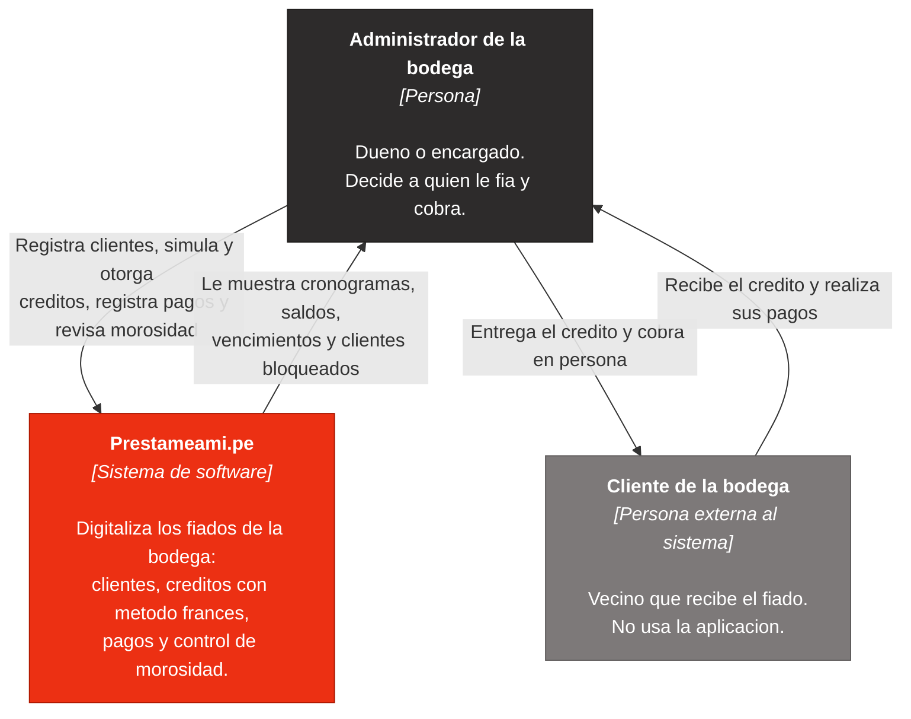

# Anexo — C4 Nivel 1: diagrama de contexto del sistema

Este documento es **solo el nivel 1 (System Context)** del modelo C4. A
proposito no aparecen el frontend, FastAPI ni SQLite: esos son componentes
internos y pertenecen a los niveles 2 y 3.

## Actores

| Elemento | Tipo | Descripcion |
| --- | --- | --- |
| Administrador de la bodega | Persona | Unico usuario del sistema. Registra clientes, otorga creditos, cobra y revisa la morosidad. |
| Prestameami.pe | Sistema de software | El sistema que se esta construyendo. Guarda clientes, creditos, cuotas y pagos, y calcula el cronograma por metodo frances. |
| Cliente de la bodega | Persona externa | Recibe el fiado y paga. **No tiene acceso al sistema**: toda la interaccion es cara a cara con el administrador. |

## Interacciones

| Origen | Destino | Interaccion |
| --- | --- | --- |
| Administrador | Prestameami.pe | Registrar clientes, simular creditos, otorgar creditos, registrar pagos, consultar morosidad. |
| Prestameami.pe | Administrador | Cronogramas de amortizacion, saldos pendientes, proximos vencimientos, alertas de clientes bloqueados. |
| Administrador | Cliente de la bodega | Entrega del dinero o la mercaderia y cobro presencial. |
| Cliente de la bodega | Administrador | Recepcion del credito y entrega de los pagos (efectivo, Yape, Plin o transferencia). |

## Alcance

**Dentro del sistema:** registro de clientes, simulacion y otorgamiento de
creditos, generacion del cronograma frances, registro de pagos con reparto
entre mora, interes y capital, y control de morosidad con bloqueo automatico.

**Fuera del sistema:** portal o app para el cliente de la bodega, notificaciones
por WhatsApp o correo, integraciones bancarias, contabilidad y scoring
crediticio. Tampoco hay sistemas externos: la aplicacion corre entera en local.
