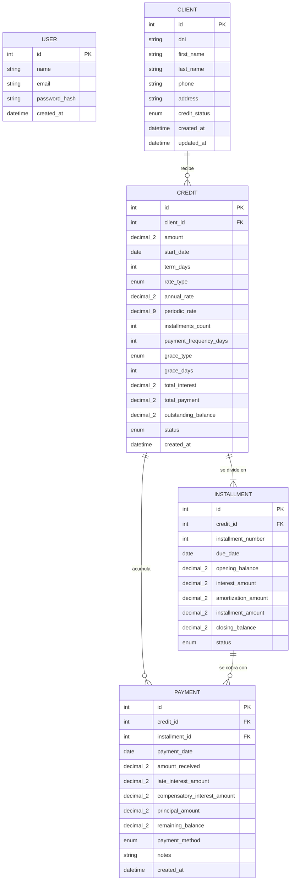

# Anexo E — Diagrama entidad-relacion (ERD)

> Documento generado automaticamente por `apps/api/scripts/generate_docs.py`.
> No lo edites a mano: su contenido se lee del sistema real.

El diagrama se lee directamente de `Base.metadata`, es decir de las tablas que el sistema crea de verdad. Si una columna no aparece aca es porque no existe en la base, y al reves.

## Cardinalidades

| Relacion | Cardinalidad | Lectura |
| --- | --- | --- |
| CLIENT — CREDIT | 1:N | Un cliente puede recibir varios creditos; cada credito pertenece a un solo cliente. |
| CREDIT — INSTALLMENT | 1:N | Un credito se divide en una o mas cuotas (minimo una, por eso la barra doble). |
| CREDIT — PAYMENT | 1:N | Un credito acumula cero o mas pagos. |
| INSTALLMENT — PAYMENT | 1:N | Una cuota puede cobrarse en varios pagos parciales. |
| USER | — | El administrador de la aplicacion. No se relaciona con los clientes de la bodega: son personas distintas. |

## Dominios de los campos enum

| Entidad | Campo | Valores |
| --- | --- | --- |
| CLIENT | credit_status | `enabled`, `blocked` |
| CREDIT | rate_type | `TNA`, `TEA` |
| CREDIT | grace_type | `none`, `partial`, `total` |
| CREDIT | status | `active`, `paid`, `overdue` |
| INSTALLMENT | status | `pending`, `paid`, `overdue` |
| PAYMENT | payment_method | `cash`, `yape`, `plin`, `transfer` |

## Notas de diseno

- **`decimal_2` y `decimal_9`.** SQLite no tiene tipo decimal nativo. Los importes se guardan como TEXT y vuelven como `Decimal` de Python, asi el saldo final es exactamente `0.00` y no un float con cola. `decimal_2` son importes en soles; `decimal_9` es la tasa periodica como fraccion, que equivale a 7 decimales cuando se muestra en porcentaje.

- **No hay columna `paid_amount` en INSTALLMENT.** Cuanto se pago de una cuota se deduce sumando sus PAYMENT. Guardarlo ademas seria un dato duplicado que se puede desincronizar.

- **No hay columna de tasa moratoria.** Es un parametro del sistema, igual para todos los creditos, y vive en la configuracion del backend (`app/core/config.py`). Se expone en `GET /api/config`.

- **No hay columna `code`.** El codigo visible del credito (`CR-0021`) se deriva del `id`.

- **No hay tabla de configuracion.** La pantalla de Configuracion muestra los parametros en solo lectura, precisamente para no crear una tabla que el ERD academico no contempla.
