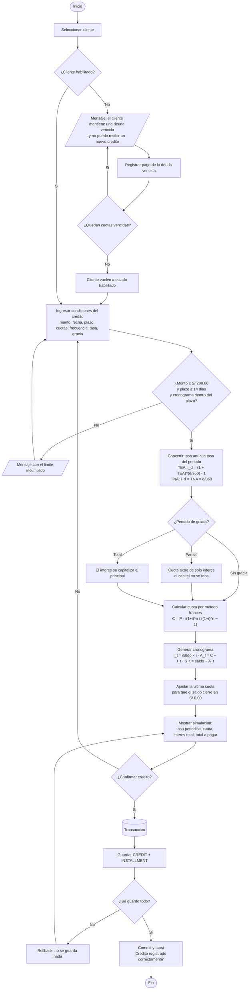
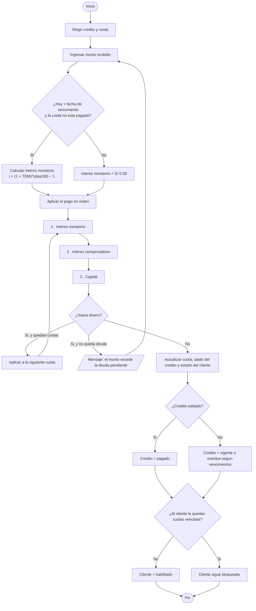

# Anexo D — Diagrama de flujo del otorgamiento de credito

Flujo principal que sigue el sistema desde que el administrador elige un cliente
hasta que el credito queda registrado con su cronograma.

## Notas

- La validacion de limites corre **en el backend**. El frontend repite las
  mismas comprobaciones solo para dar feedback inmediato, pero la decision final
  siempre es del servidor.
- El estado de mora se recalcula **antes** de evaluar si el cliente esta
  habilitado, no despues: un cliente cuya cuota vencio hoy queda bloqueado en el
  mismo momento en que se intenta otorgarle credito.
- El bloque `Transaccion` es literal: credito y cuotas se guardan juntos o no se
  guarda nada (`apps/api/app/services/credits.py`).

## Flujo de registro de pago

