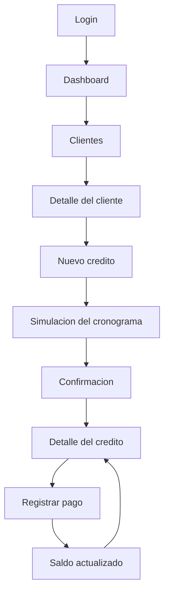
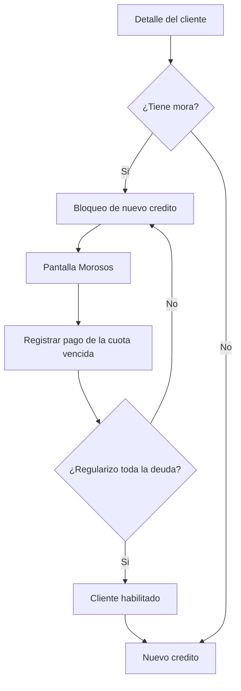
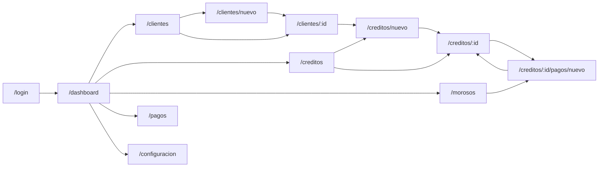

# Anexo — User flow

Recorrido del administrador de la bodega por la aplicacion.

## Flujo principal

## Rama de morosidad

## Mapa de navegacion

## Pantallas

| Pantalla | Ruta | Que resuelve |
| --- | --- | --- |
| Login | `/login` | Acceso del administrador. |
| Dashboard | `/dashboard` | Creditos activos, por cobrar, cobros de hoy, bloqueados, proximos vencimientos. |
| Clientes | `/clientes` | Buscar, filtrar por estado y ordenar por deuda. |
| Nuevo cliente | `/clientes/nuevo` | Registrar a la persona antes de fiarle. |
| Detalle del cliente | `/clientes/:id` | Saldo, creditos, pagos e historial. |
| Nuevo credito | `/creditos/nuevo` | Simular y otorgar. |
| Creditos | `/creditos` | Todos los creditos, filtrables por estado. |
| Detalle del credito | `/creditos/:id` | Condiciones, cronograma completo e historial de pagos. |
| Registrar pago | `/creditos/:id/pagos/nuevo` | Cobrar y ver como se reparte el dinero. |
| Pagos | `/pagos` | Todos los cobros registrados. |
| Morosos | `/morosos` | Cuotas vencidas y clientes bloqueados. |
| Configuracion | `/configuracion` | Parametros vigentes del producto (solo lectura). |
