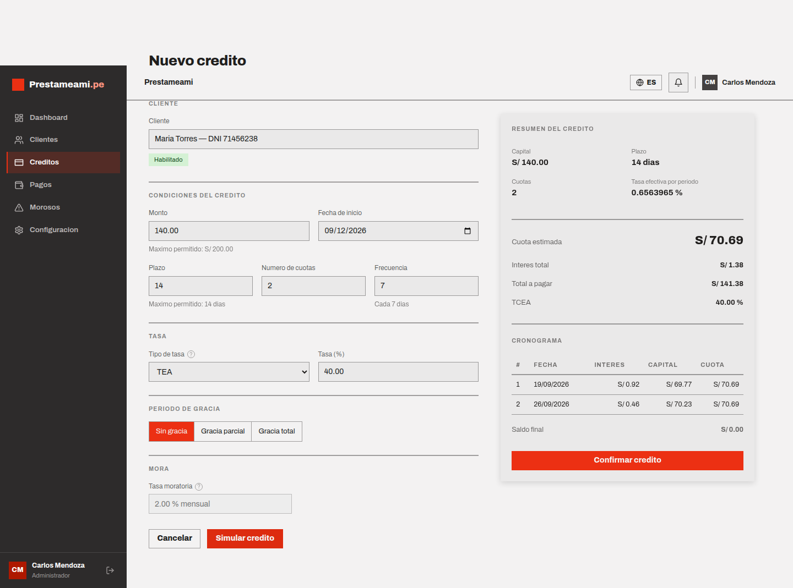
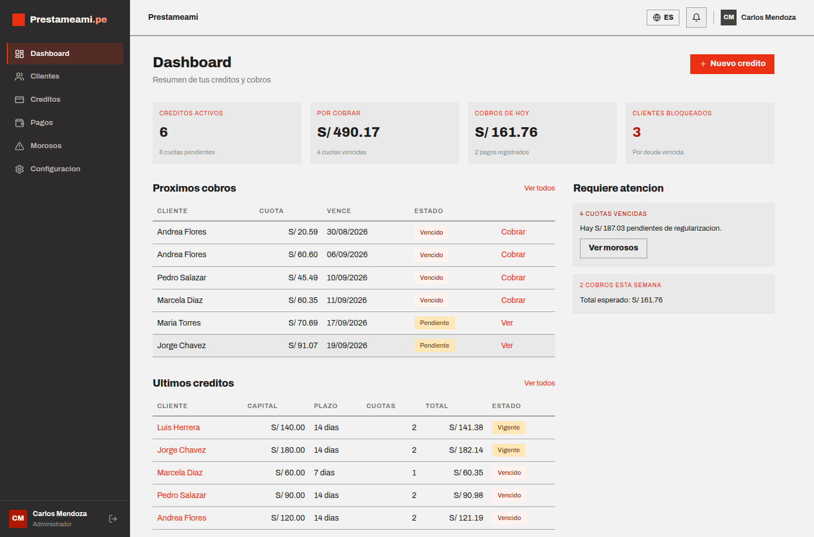
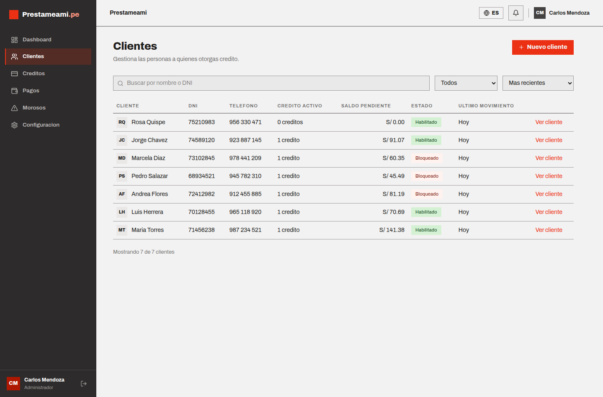
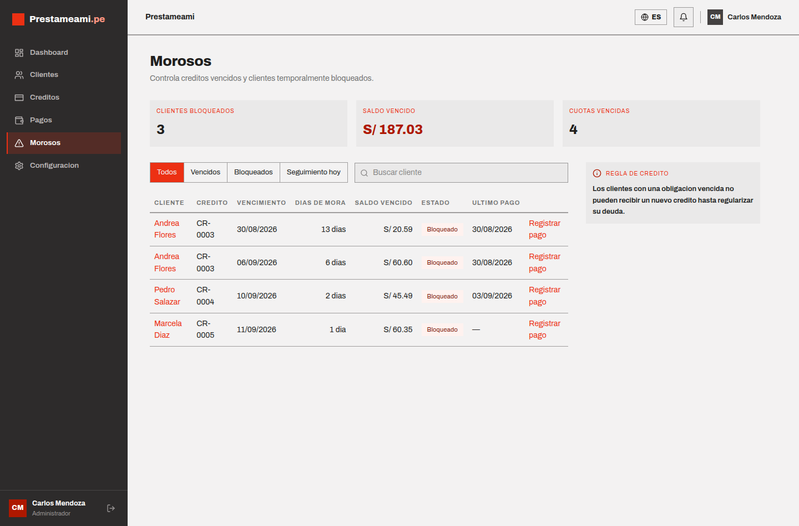
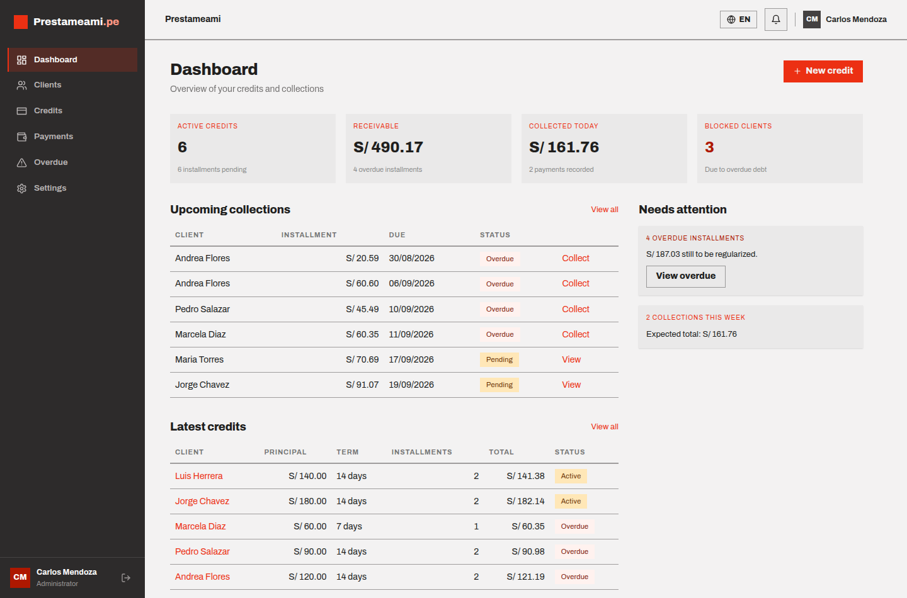

# Anexo F — Evidencias de validacion
> Documento generado automaticamente por `apps/api/scripts/generate_docs.py`.
> No lo edites a mano: su contenido se lee del sistema real.

Generado el 12/09/2026.

## 1. Como obtener cada evidencia

| # | Evidencia | Como obtenerla |
| --- | --- | --- |
| 1 | Ejecucion de la bateria de tests | `cd apps/api && uv run pytest -v` |
| 2 | Resultado del caso de prueba 1 | `uv run pytest -v -k caso-1` |
| 3 | Resultado del caso de prueba 2 | `uv run pytest -v -k caso-2` |
| 4 | Respuesta JSON de `/credits/simulate` | Ver el comando del punto 4 mas abajo |
| 5 | Captura del frontend con el cronograma | [docs/evidence/04-simulador-cronograma.png](evidence/04-simulador-cronograma.png), o abrir http://localhost:5173 -> Nuevo credito -> Simular |
| 6 | Comparacion esperado vs obtenido | Tabla de la seccion 5 de este documento |
| 7 | Saldo final = 0 | Ultima fila de cada cronograma en [Anexo C](test-cases.md) |
| 8 | Contraste contra Excel | [prestameami-cronogramas.xlsx](evidence/prestameami-cronogramas.xlsx) — ver seccion 5 |

### Comando para la evidencia 4

```bash
TOKEN=$(curl -s -X POST http://localhost:8000/api/auth/login \
  -H 'Content-Type: application/json' \
  -d '{"email":"admin@prestameami.pe","password":"admin123"}' | jq -r .access_token)

curl -s -X POST http://localhost:8000/api/credits/simulate \
  -H "Authorization: Bearer $TOKEN" \
  -H 'Content-Type: application/json' \
  -d '{
    "client_id": 1,
    "amount": "140.00",
    "rate_type": "TEA",
    "annual_rate": "40.00",
    "start_date": "2026-09-12",
    "term_days": 14,
    "installments_count": 2,
    "payment_frequency_days": 7,
    "grace_type": "none",
    "grace_days": 0
  }' | jq
```

## 2. Resultado de la bateria de tests

```
$ uv run pytest -q
242 passed, 2 warnings in 41.44s
```

Los tests cubren la conversion de tasas, el metodo frances, la tasa cero, los limites de monto y plazo, los periodos de gracia, el interes moratorio, el bloqueo de clientes morosos y el flujo completo de la demo por HTTP.

## 3. Capturas de la aplicacion

Capturadas sobre la aplicacion en ejecucion (API en el puerto 8000 y frontend
en el 5173) con la base cargada por `scripts/seed.py`.

### Simulador con el cronograma frances



Credito de S/ 140.00 a TEA 40 %, 14 dias, 2 cuotas cada 7 dias. La tasa
periodica es 0.6563965 %, la cuota S/ 70.69, el interes total S/ 1.38, el total
a pagar S/ 141.38 y el **saldo final S/ 0.00**. Los mismos numeros que devuelve
`POST /api/credits/simulate` y que verifican los tests.

### Dashboard



### Clientes



### Morosos y clientes bloqueados



### Interfaz en ingles (i18n)



## 4. Contraste contra Excel

El archivo [prestameami-cronogramas.xlsx](evidence/prestameami-cronogramas.xlsx)
reconstruye los dos casos **con formulas vivas de Excel**, no con numeros
pegados. Cada hoja trae abajo una tabla que resta lo que calcula Excel menos lo
que devuelve el sistema; la columna Diferencia debe dar 0.00 en todas las filas.

| Concepto | Formula en la hoja |
| --- | --- |
| Tasa periodica | `=REDONDEAR((1+TEA)^(dias/360)-1; 9)` |
| Cuota | `=REDONDEAR(PAGO(i; n; -P); 2)` |
| Interes del periodo | `=REDONDEAR(saldo_anterior * i; 2)` |
| Amortizacion | `=REDONDEAR(cuota - interes; 2)` |
| Saldo | `=REDONDEAR(saldo_anterior - amortizacion; 2)` |
| Ultima cuota | amortiza todo el saldo restante, para cerrar en 0.00 |

La hoja **Simulador libre** permite cambiar capital, TEA, numero de cuotas y
frecuencia, y recalcula el cronograma completo dentro de Excel.

Esta equivalencia no se afirma de palabra: `tests/test_excel.py` regenera el
libro, se lo entrega a LibreOffice para que **recalcule de verdad** todas las
formulas, y compara celda por celda contra el motor. Si alguna vez divergen, la
bateria de tests se pone en rojo.

Para regenerarlo:

```bash
cd apps/api && uv run python scripts/generate_excel.py
```

## 5. Comparacion esperado vs obtenido

La columna **Esperado** son los valores calculados a mano con las formulas del enunciado (definidos en `apps/api/scripts/academic_cases.py`). La columna **Sistema** es lo que devuelve el motor al ejecutarse ahora mismo.

### Caso 1 — S/ 200.00, TEA 60 %, 14 dias, 2 cuotas cada 7 dias

| Variable | Esperado | Sistema | Diferencia | Resultado |
| --- | ---: | ---: | ---: | :---: |
| Tasa efectiva por periodo (%) | 0.9180847 | 0.9180847 | +0.0000000 | OK |
| Cuota constante | 101.38 | 101.38 | +0.00 | OK |
| Interes total | 2.76 | 2.76 | +0.00 | OK |
| Total a pagar | 202.76 | 202.76 | +0.00 | OK |
| Saldo final | 0.00 | 0.00 | +0.00 | OK |
| Cuota 1 — interes | 1.84 | 1.84 | +0.00 | OK |
| Cuota 1 — amortizacion | 99.54 | 99.54 | +0.00 | OK |
| Cuota 1 — saldo final | 100.46 | 100.46 | +0.00 | OK |
| Cuota 2 — interes | 0.92 | 0.92 | +0.00 | OK |
| Cuota 2 — amortizacion | 100.46 | 100.46 | +0.00 | OK |
| Cuota 2 — saldo final | 0.00 | 0.00 | +0.00 | OK |

### Caso 2 — S/ 120.00, TEA 40 %, 14 dias, 2 cuotas cada 7 dias

| Variable | Esperado | Sistema | Diferencia | Resultado |
| --- | ---: | ---: | ---: | :---: |
| Tasa efectiva por periodo (%) | 0.6563965 | 0.6563965 | +0.0000000 | OK |
| Cuota constante | 60.59 | 60.59 | +0.00 | OK |
| Interes total | 1.19 | 1.19 | +0.00 | OK |
| Total a pagar | 121.19 | 121.19 | +0.00 | OK |
| Saldo final | 0.00 | 0.00 | +0.00 | OK |
| Cuota 1 — interes | 0.79 | 0.79 | +0.00 | OK |
| Cuota 1 — amortizacion | 59.80 | 59.80 | +0.00 | OK |
| Cuota 1 — saldo final | 60.20 | 60.20 | +0.00 | OK |
| Cuota 2 — interes | 0.40 | 0.40 | +0.00 | OK |
| Cuota 2 — amortizacion | 60.20 | 60.20 | +0.00 | OK |
| Cuota 2 — saldo final | 0.00 | 0.00 | +0.00 | OK |


## 6. Conclusion

Todas las variables comparadas coinciden exactamente con el calculo manual: diferencia de 0.00 en cada fila. El saldo final de ambos cronogramas cierra en S/ 0.00, como exige el metodo frances.
